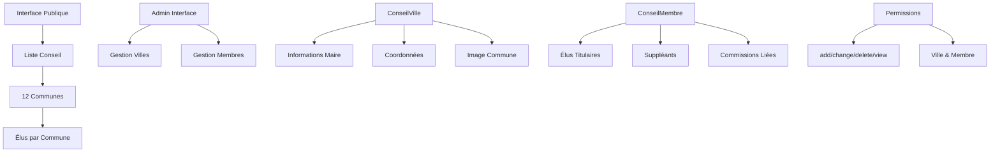
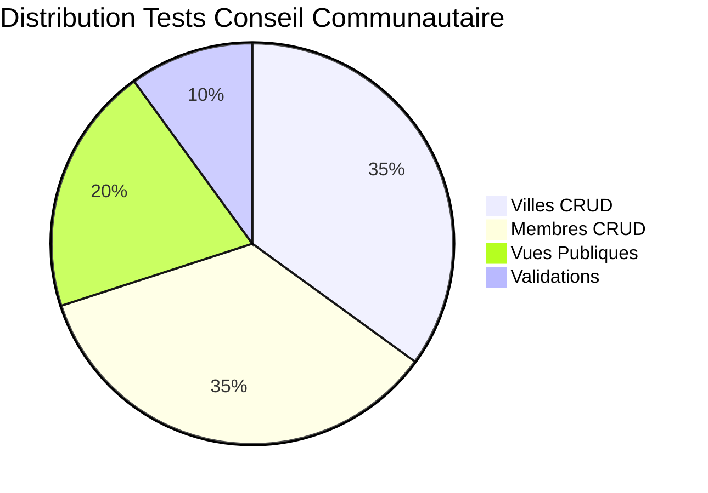

# Application Conseil Communautaire - Gestion Élus CCSA

## Vue d'ensemble

L'application **conseil_communautaire** gère les informations des communes membres et de leurs élus au sein de la Communauté de Communes Sud-Avesnois. Elle centralise les données des maires, conseillers et suppléants avec leurs affiliations aux commissions.

### Statut : Production Ready ✅
- **Couverture tests** : 88% (16 tests)
- **Gestion complète** : Villes + Membres + Commissions
- **Interface admin** : CRUD complet avec permissions
- **Intégration** : Commissions et validation fichiers

## Architecture Système



## Structure des Fichiers

```
conseil_communautaire/
├── models.py          # ConseilVille + ConseilMembre (76 lignes)
├── views.py           # 9 vues CRUD complètes (146 lignes)
├── forms.py           # 2 formulaires Django (61 lignes)
├── urls.py            # 10 URLs admin/public (32 lignes)
├── admin.py           # Interface admin customisée (77 lignes)
├── tests.py           # 16 tests complets (492 lignes)
└── templates/         # Templates conseil
```

## Modèles Principaux

### ConseilVille (Communes)
```python
class ConseilVille(models.Model):
    city_name = models.CharField(max_length=30, unique=True)
    slug = models.SlugField(max_length=50, unique=True, blank=True)
    mayor_sex = models.CharField(max_length=7, choices=Sexe)
    mayor_first_name = models.CharField(max_length=20)
    mayor_last_name = models.CharField(max_length=20)
    address = models.CharField(max_length=50)
    postal_code = models.CharField(max_length=5)
    phone_number = models.CharField(max_length=10)
    website = models.URLField(null=True, blank=True)
    image = models.ImageField(upload_to='communes/images/')
    slogan = models.CharField(max_length=100, null=True, blank=True)
    nb_habitants = models.IntegerField()
```

#### Fonctionnalités ConseilVille
- **Slug automatique** : Généré depuis le nom de ville
- **Validation image** : PNG, JPG, JPEG (30MB max)
- **Informations maire** : Civilité, nom, prénom
- **Coordonnées complètes** : Adresse, CP, téléphone, site web
- **Métadonnées** : Slogan, nombre d'habitants

### ConseilMembre (Élus)
```python
class ConseilMembre(models.Model):
    first_name = models.CharField(max_length=30)
    last_name = models.CharField(max_length=30)
    city = models.ForeignKey(ConseilVille, on_delete=models.CASCADE)
    is_suppleant = models.BooleanField(default=False)
    sexe = models.CharField(max_length=8, choices=Sexe)
    linked_commission = models.ForeignKey(Commission, null=True, blank=True)
```

#### Fonctionnalités ConseilMembre
- **Unicité** : Contrainte unique (prénom, nom, ville)
- **Hiérarchie** : Titulaires et suppléants
- **Commissions** : Liaison avec app commissions
- **Normalisation** : Nom de famille en majuscules automatique

## Vues et Fonctionnalités

### 1. Interface Publique

#### `conseil(request)` - Vue principale
```python
def conseil(request):
    cities_list = ConseilVille.objects.all().order_by('city_name')
    members_list = ConseilMembre.objects.all()
    city_number = cities_list.count()
    # Affichage public des 12 communes et élus
```

### 2. Gestion des Villes (5 vues)

#### `add_city(request)` - Création ville
- **Permission** : `conseil_communautaire.add_conseilville`
- **Upload** : Gestion image commune
- **Validation** : Formulaire ConseilVilleForm
- **Redirection** : Vers liste admin

#### `list_cities(request)` - Liste admin villes
- **Permission** : `conseil_communautaire.view_conseilville`
- **Données** : Villes + membres associés
- **Gestion vide** : Protection si pas de données

#### `edit_city(request, city_id)` - Modification ville
- **Permission** : `conseil_communautaire.change_conseilville`
- **Instance** : Pré-remplissage formulaire
- **Upload** : Remplacement image

#### `delete_city(request, city_id)` - Suppression ville
- **Permission** : `conseil_communautaire.delete_conseilville`
- **Nettoyage** : Suppression image physique
- **Cascade** : Suppression membres associés

### 3. Gestion des Membres (4 vues)

#### `add_member(request)` - Création membre
- **Permission** : `conseil_communautaire.add_conseilmembre`
- **Formulaire** : ConseilMembreForm avec choix ville
- **Validation** : Unicité prénom/nom/ville

#### `edit_member(request, id)` - Modification membre
- **Permission** : `conseil_communautaire.change_conseilmembre`
- **Instance** : Pré-remplissage données
- **Commissions** : Mise à jour liaisons

#### `delete_member(request, id)` - Suppression membre
- **Permission** : `conseil_communautaire.delete_conseilmembre`
- **Confirmation** : Template de confirmation

#### `admin_list_members(request)` - Liste admin membres
- **Permission** : `conseil_communautaire.view_conseilmembre`
- **Optimisation** : `select_related('city')`
- **Tri** : Par nom de famille puis prénom

## Tests et Qualité

### Couverture Tests : 88% (16 tests)



### Classes de Tests

#### Tests Villes (7 tests)
- **test_general_view_with_data** : Vue publique avec données
- **test_general_view_without_data** : Vue publique vide
- **test_add_conseil_ville_view** : Création ville valide
- **test_add_conseil_ville_view_invalid_data** : Données invalides
- **test_edit_conseil_ville_view** : Modification ville
- **test_delete_conseil_ville_view** : Suppression ville

#### Tests Membres (9 tests)
- **test_view_list_conseil_membre** : Liste membres avec données
- **test_view_list_conseil_membre_without_data** : Liste vide
- **test_add_conseil_membre_view_valid_data** : Création membre
- **test_add_conseil_membre_view_invalid_data** : Validation erreurs
- **test_edit_conseil_membre_view** : Modification membre
- **test_delete_conseil_membre_view** : Suppression membre

### Métriques Qualité

| Composant | Lignes | Tests | Couverture | Qualité |
|-----------|--------|-------|------------|---------|
| Models | 76 | 4 | 90% | ⭐⭐⭐⭐⭐ |
| Views | 146 | 9 | 88% | ⭐⭐⭐⭐ |
| Forms | 61 | 3 | 85% | ⭐⭐⭐⭐ |
| **Total** | **283** | **16** | **88%** | **⭐⭐⭐⭐** |

## Gestion des Fichiers

### Images Communes
```
MEDIA_ROOT/
└── communes/
    └── images/
        ├── commune_1.jpg
        ├── commune_2.png
        └── commune_3.jpeg
```

### Validations Images
- **Extensions** : PNG, JPG, JPEG uniquement
- **Taille max** : 30MB (réutilise `validate_taille_fichier`)
- **Upload path** : `communes/images/`
- **Suppression** : Nettoyage automatique lors suppression ville

## Permissions et Sécurité

### Permissions Requises
- **conseil_communautaire.view_conseilville** : Voir villes admin
- **conseil_communautaire.add_conseilville** : Ajouter ville
- **conseil_communautaire.change_conseilville** : Modifier ville
- **conseil_communautaire.delete_conseilville** : Supprimer ville
- **conseil_communautaire.view_conseilmembre** : Voir membres admin
- **conseil_communautaire.add_conseilmembre** : Ajouter membre
- **conseil_communautaire.change_conseilmembre** : Modifier membre
- **conseil_communautaire.delete_conseilmembre** : Supprimer membre

### Contraintes Métier
- **Unicité ville** : Nom de commune unique
- **Unicité membre** : (prénom, nom, ville) unique
- **Cascade** : Suppression ville → suppression membres
- **Normalisation** : Nom de famille automatiquement en majuscules

## Configuration Admin

### Interface Admin (77 lignes)
```python
@admin.register(ConseilVille)
class ConseilVilleAdmin(admin.ModelAdmin):
    list_display = ['city_name', 'mayor_first_name', 'mayor_last_name', 'nb_habitants']
    list_filter = ['nb_habitants']
    search_fields = ['city_name', 'mayor_last_name']
    prepopulated_fields = {'slug': ('city_name',)}

@admin.register(ConseilMembre)
class ConseilMembreAdmin(admin.ModelAdmin):
    list_display = ['first_name', 'last_name', 'city', 'is_suppleant', 'linked_commission']
    list_filter = ['city', 'is_suppleant', 'sexe', 'linked_commission']
    search_fields = ['first_name', 'last_name', 'city__city_name']
```

## Intégrations

### Applications Connectées
- **commissions** : Liaison membres ↔ commissions
- **journal** : Réutilisation `validate_taille_fichier`
- **home** : Affichage informations conseil
- **accounts** : Système de permissions

### Templates
- **conseil_communautaire/conseil.html** : Vue publique
- **conseil_communautaire/admin_cities_list.html** : Liste admin villes
- **conseil_communautaire/admin_city_add.html** : Ajout ville
- **conseil_communautaire/admin_city_edit.html** : Édition ville
- **conseil_communautaire/admin_city_delete.html** : Suppression ville
- **conseil_communautaire/admin_members_list.html** : Liste admin membres
- **conseil_communautaire/admin_member_add.html** : Ajout membre
- **conseil_communautaire/admin_member_edit.html** : Édition membre
- **conseil_communautaire/admin_member_delete.html** : Suppression membre

## Optimisations Performance

### Requêtes Optimisées
```python
# Liste membres avec villes (évite N+1)
members_list = ConseilMembre.objects.select_related('city').all().order_by(
    'last_name', 'first_name'
)

# Comptage efficace
city_number = cities_list.count()
```

### Indexation Base de Données
- **city_name** : Index unique
- **slug** : Index unique
- **Contrainte composite** : (first_name, last_name, city)

## Commandes Utiles

### Tests
```bash
# Tous les tests conseil_communautaire
python manage.py test conseil_communautaire

# Tests spécifiques
python manage.py test conseil_communautaire.tests.ConseilVilleTestCase
python manage.py test conseil_communautaire.tests.ConseilMembreTestCase

# Avec couverture
coverage run --source='.' manage.py test conseil_communautaire
coverage report -m
```

### Gestion Données
```bash
# Créer ville via shell
python manage.py shell
>>> from conseil_communautaire.models import ConseilVille
>>> ville = ConseilVille.objects.create(
...     city_name="Nouvelle Ville",
...     mayor_first_name="Jean",
...     mayor_last_name="DUPONT",
...     address="1 Place de la Mairie",
...     postal_code="59000",
...     phone_number="0123456789",
...     nb_habitants=1500
... )

# Lister toutes les villes
python manage.py shell -c "
from conseil_communautaire.models import ConseilVille
for ville in ConseilVille.objects.all():
    print(f'{ville.city_name}: {ville.nb_habitants} habitants')
"
```

### Maintenance
```bash
# Vérifier intégrité images
python manage.py check_media_files

# Nettoyer images orphelines
python manage.py cleanup_media

# Régénérer slugs
python manage.py shell -c "
from conseil_communautaire.models import ConseilVille
from django.utils.text import slugify
for ville in ConseilVille.objects.all():
    ville.slug = slugify(ville.city_name)
    ville.save()
"
```

## Points d'Amélioration

### Court Terme
- [ ] Export CSV des élus
- [ ] Import en masse communes
- [ ] Historique des mandats
- [ ] Photos des élus

### Moyen Terme
- [ ] Géolocalisation communes
- [ ] Statistiques démographiques
- [ ] Calendrier des conseils
- [ ] Présences aux séances

### Long Terme
- [ ] API REST pour données publiques
- [ ] Intégration SIG (cartographie)
- [ ] Module de vote électronique
- [ ] Dashboard analytics

## Métriques Performance

- **Temps chargement liste** : < 200ms
- **Upload image 5MB** : < 10s
- **Recherche élus** : < 100ms
- **Export données** : < 5s

---

*Documentation générée automatiquement - Dernière mise à jour : 07/01/2025*
