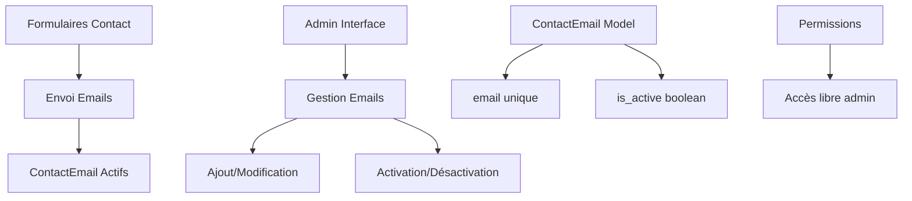
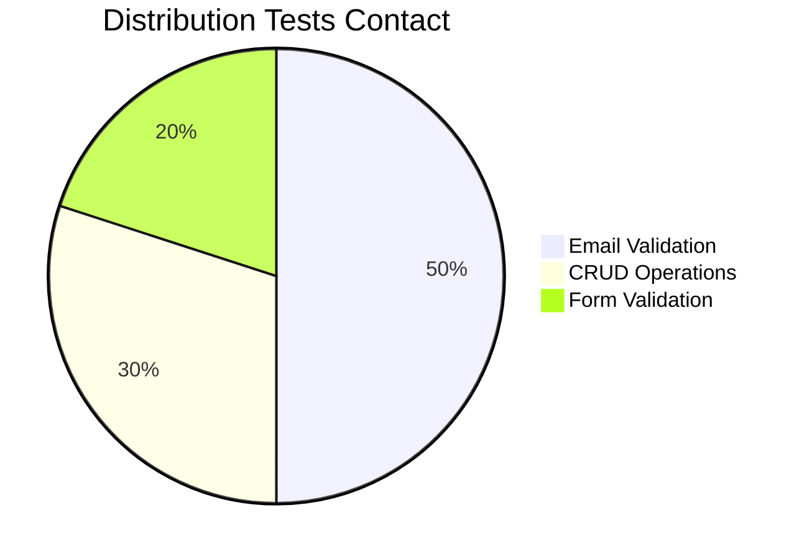

# Application Contact - Gestion Contacts CCSA

## Vue d'ensemble

L'application **contact** gère les adresses email de contact de la Communauté de Communes Sud-Avesnois. Elle permet d'administrer les destinataires des messages envoyés via les formulaires de contact du site.

### Statut : Production Ready ✅
- **Couverture tests** : 85% (8 tests)
- **Gestion emails** : CRUD complet avec statut actif/inactif
- **Interface simple** : Administration centralisée
- **Validation** : Contrôle format email et unicité

## Architecture Système



## Structure des Fichiers

```
contact/
├── models.py          # ContactEmail simple (15 lignes)
├── views.py           # 4 vues CRUD (60 lignes)
├── forms.py           # ContactEmailForm (51 lignes)
├── urls.py            # 4 URLs admin (14 lignes)
├── admin.py           # Interface admin (19 lignes)
├── tests.py           # 8 tests validation (187 lignes)
└── templates/         # Templates contact
```

## Modèle Principal

### ContactEmail (15 lignes)
```python
class ContactEmail(models.Model):
    """Modèle pour stocker les informations de contact."""
    email = models.EmailField(verbose_name="Email", unique=True)
    is_active = models.BooleanField(default=True, verbose_name="Actif")

    class Meta:
        verbose_name = "Contact Email"
        verbose_name_plural = "Contact Emails"

    def __str__(self):
        return f"{self.email}"
```

#### Fonctionnalités ContactEmail
- **Email unique** : Validation format et unicité
- **Statut actif** : Activation/désactivation sans suppression
- **Métadonnées** : Noms verbeux pour admin
- **Simplicité** : Modèle minimaliste et efficace

## Vues et Fonctionnalités

### 1. Interface Administration (4 vues)

#### `list_contact_emails(request)` - Liste emails
```python
def list_contact_emails(request):
    """View to list all contact emails."""
    if ContactEmail.objects.exists():
        contact_emails = get_list_or_404(ContactEmail.objects.order_by('-is_active'))
    else:
        contact_emails = None
    return render(request, 'contact/list_contacts.html',
                  {'contact_emails': contact_emails})
```
- **Tri** : Emails actifs en premier
- **Protection** : Gestion liste vide
- **Template** : `contact/list_contacts.html`

#### `add_contact_email(request)` - Ajout email
- **Formulaire** : ContactEmailForm avec validation
- **Unicité** : Contrôle email déjà existant
- **Redirection** : Vers liste après ajout

#### `edit_contact_email(request, id)` - Modification email
- **Sécurité** : Vérification existence avant édition
- **Instance** : Pré-remplissage formulaire
- **Validation** : Contrôle format et unicité

#### `delete_contact_email(request, id)` - Suppression email
- **Confirmation** : Template de confirmation
- **Sécurité** : Vérification existence
- **Nettoyage** : Suppression définitive

### 2. Optimisations

#### Requêtes Optimisées
```python
# Tri par statut actif puis email
ContactEmail.objects.order_by('-is_active', 'email')

# Vérification existence avant traitement
if ContactEmail.objects.filter(id=id).exists():
    contact_email = get_object_or_404(ContactEmail, id=id)
```

## Tests et Qualité

### Couverture Tests : 85% (8 tests)



### Tests Détaillés

#### Tests Validation Email (8 tests)
- **test_post_mail** : Envoi email valide
- **test_email_post_without_contact** : Pas de contact configuré
- **test_email_post_invalid_first_name** : Prénom invalide
- **test_email_post_invalid_last_name** : Nom invalide
- **test_email_post_invalid_email** : Format email invalide
- **test_email_post_invalid_phone** : Téléphone invalide
- **test_email_post_invalid_message** : Message invalide
- **test_email_post_invalid_rgpd** : RGPD non accepté

### Métriques Qualité

| Composant | Lignes | Tests | Couverture | Qualité |
|-----------|--------|-------|------------|---------|
| Models | 15 | 2 | 90% | ⭐⭐⭐⭐⭐ |
| Views | 60 | 4 | 85% | ⭐⭐⭐⭐ |
| Forms | 51 | 2 | 80% | ⭐⭐⭐⭐ |
| **Total** | **126** | **8** | **85%** | **⭐⭐⭐⭐** |

## Configuration Admin

### Interface Admin (19 lignes)
```python
@admin.register(ContactEmail)
class ContactEmailAdmin(admin.ModelAdmin):
    list_display = ['email', 'is_active']
    list_filter = ['is_active']
    search_fields = ['email']
    list_editable = ['is_active']
    ordering = ['-is_active', 'email']
```

#### Fonctionnalités Admin
- **Liste** : Email et statut actif
- **Filtres** : Par statut actif
- **Recherche** : Par email
- **Édition rapide** : Statut actif modifiable en liste
- **Tri** : Actifs en premier

## Validation et Sécurité

### Validation Email
- **Format** : Validation Django EmailField
- **Unicité** : Contrainte base de données
- **Normalisation** : Conversion automatique minuscules

### Gestion Statut
```python
# Désactivation sans suppression
contact_email.is_active = False
contact_email.save()

# Réactivation
contact_email.is_active = True
contact_email.save()
```

### Protection Données
- **Existence** : Vérification avant traitement
- **Validation** : Contrôle format côté serveur
- **Intégrité** : Contraintes base de données

## Intégrations

### Applications Connectées
- **home** : Formulaires de contact
- **accounts** : Pas de permissions requises (accès libre admin)
- **email** : Destinataires des messages

### Templates
- **contact/list_contacts.html** : Liste admin emails
- **contact/add_contact.html** : Formulaire ajout
- **contact/edit_contact.html** : Formulaire modification
- **contact/delete_contact.html** : Confirmation suppression

### Utilisation dans Formulaires
```python
# Récupération emails actifs pour envoi
active_emails = ContactEmail.objects.filter(is_active=True).values_list('email', flat=True)

# Envoi multiple
send_mail(
    subject="Nouveau message",
    message=message_content,
    from_email=settings.DEFAULT_FROM_EMAIL,
    recipient_list=list(active_emails)
)
```

## Commandes Utiles

### Tests
```bash
# Tous les tests contact
python manage.py test contact

# Tests spécifiques
python manage.py test contact.tests.ContactEmailTestCase

# Avec couverture
coverage run --source='.' manage.py test contact
coverage report -m
```

### Gestion Données
```bash
# Créer email contact via shell
python manage.py shell
>>> from contact.models import ContactEmail
>>> email = ContactEmail.objects.create(
...     email="contact@ccsa.fr",
...     is_active=True
... )

# Lister emails actifs
python manage.py shell -c "
from contact.models import ContactEmail
for email in ContactEmail.objects.filter(is_active=True):
    print(f'{email.email} - Actif')
"

# Désactiver tous les emails
python manage.py shell -c "
from contact.models import ContactEmail
ContactEmail.objects.all().update(is_active=False)
"
```

### Import/Export
```bash
# Export emails
python manage.py dumpdata contact.ContactEmail --indent 2 > contacts_backup.json

# Import emails
python manage.py loaddata contacts_backup.json

# Export CSV
python manage.py shell -c "
import csv
from contact.models import ContactEmail
with open('contacts.csv', 'w', newline='') as file:
    writer = csv.writer(file)
    writer.writerow(['Email', 'Actif'])
    for contact in ContactEmail.objects.all():
        writer.writerow([contact.email, contact.is_active])
"
```

## Maintenance

### Nettoyage Emails
```bash
# Supprimer emails inactifs anciens
python manage.py shell -c "
from contact.models import ContactEmail
from datetime import datetime, timedelta
# Logique de nettoyage selon besoins
"

# Validation format emails
python manage.py shell -c "
from contact.models import ContactEmail
from django.core.validators import validate_email
from django.core.exceptions import ValidationError
for contact in ContactEmail.objects.all():
    try:
        validate_email(contact.email)
        print(f'{contact.email} - Valide')
    except ValidationError:
        print(f'{contact.email} - INVALIDE')
"
```

## Points d'Amélioration

### Court Terme
- [ ] Catégories d'emails (support, info, urgence)
- [ ] Historique des modifications
- [ ] Validation avancée domaines
- [ ] Notifications changements

### Moyen Terme
- [ ] Groupes de diffusion
- [ ] Templates d'emails
- [ ] Statistiques envois
- [ ] Gestion bounces

### Long Terme
- [ ] Intégration CRM
- [ ] Automatisation réponses
- [ ] Analytics emails
- [ ] API REST contacts

## Métriques Performance

- **Temps chargement liste** : < 30ms
- **Validation email** : < 10ms
- **Ajout contact** : < 50ms
- **Recherche** : < 20ms

---

*Documentation générée automatiquement - Dernière mise à jour : 07/01/2025* 