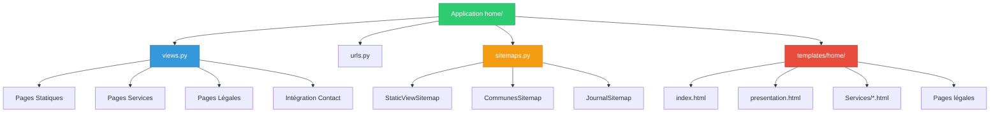
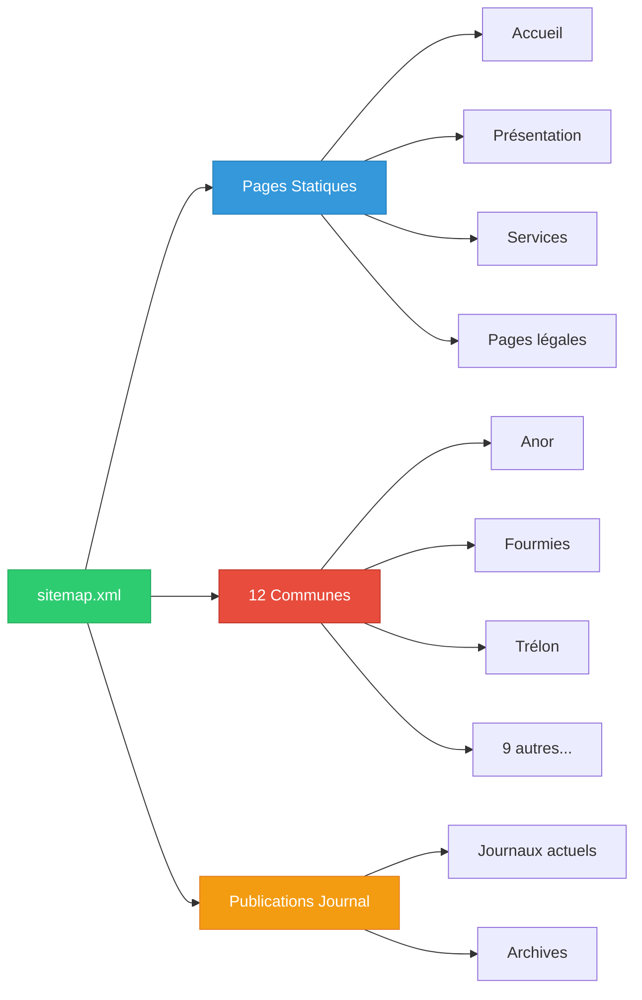
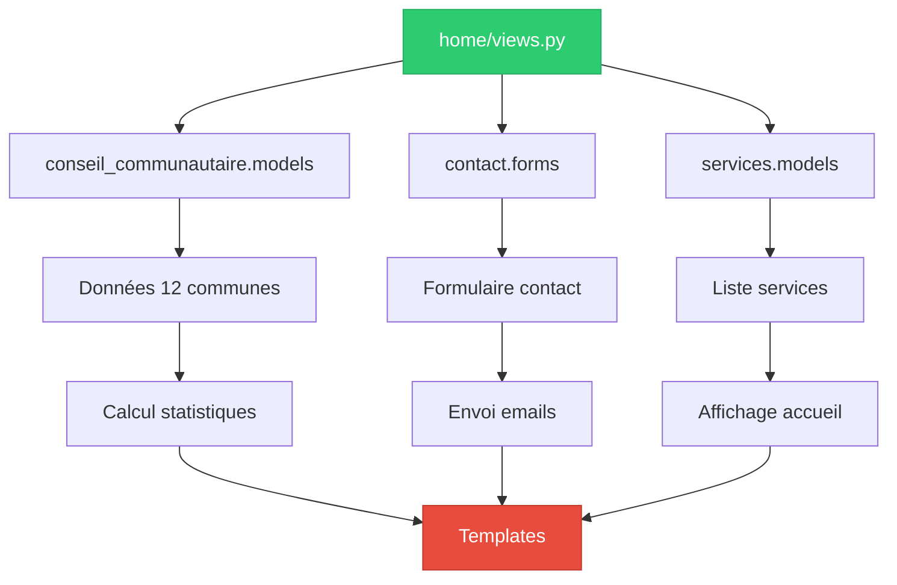

# Application Home - Documentation

## 📋 Vue d'ensemble

L'application **home** est l'application principale du projet CCSA. Elle gère la page d'accueil, les pages institutionnelles, les services publics et les fonctionnalités transversales du site.

### Rôle et Responsabilités

- 🏠 **Page d'accueil** : Point d'entrée principal du site
- 📋 **Pages institutionnelles** : Présentation, équipe, services
- 📧 **Formulaire de contact** : Intégration avec l'app contact
- 🔗 **Navigation principale** : Liens vers toutes les sections
- 📜 **Pages légales** : Mentions légales, RGPD, accessibilité
- 🗺️ **Sitemap XML** : Génération automatique pour le SEO

## 🏗️ Structure de l'Application



## 📁 Architecture des Fichiers

### Structure Complète

```
home/
├── __init__.py
├── apps.py                    # Configuration Django
├── views.py                   # 19 vues (206 lignes)
├── urls.py                    # 18 routes URL
├── sitemaps.py               # 3 sitemaps XML
├── models.py                 # Vide (pages statiques)
├── forms.py                  # Vide (utilise contact.forms)
├── tests.py                  # Vide (à compléter)
├── admin.py                  # Vide (pas de modèles)
├── templates/home/           # Templates spécifiques
│   ├── index.html           # Page d'accueil
│   ├── presentation.html    # Présentation CCSA
│   ├── equipe.html         # Équipe administrative
│   ├── collecte-dechets.html # Services déchets
│   ├── maisons-sante.html   # Maisons de santé
│   ├── mentions-legales.html # Mentions légales
│   ├── accessibilite.html   # Page accessibilité
│   └── [autres pages]...
├── management/              # Commandes Django personnalisées
└── migrations/              # Vide (pas de modèles)
```

## 🔧 Analyse des Vues

### Vue Principale - `home()`

```python
def home(request):
    """Page d'accueil avec intégration des services et formulaire de contact."""
    
    # Récupération des données
    services = get_list_or_404(Service.objects.order_by('title')) if Service.objects.exists() else None
    communes = get_list_or_404(ConseilVille) if ConseilVille.objects.exists() else None
    
    # Calcul des statistiques
    if communes:
        nb_communes = len(communes)
        nb_habitants = sum(commune.nb_habitants for commune in communes)
    
    # Traitement du formulaire de contact
    if request.method == 'POST':
        contact_form = ContactForm(request.POST)
        if contact_form.is_valid():
            # Envoi d'emails (CCSA + confirmation client)
            # Redirection après succès
    
    return render(request, 'home/index.html', context)
```

**Fonctionnalités** :
- ✅ Affichage des services disponibles
- ✅ Statistiques des communes (nombre, habitants)
- ✅ Intégration formulaire de contact
- ✅ Envoi d'emails automatiques
- ✅ Gestion des erreurs gracieuse

### Vues de Services

| Vue | URL | Description |
|-----|-----|-------------|
| `collecte_dechets` | `/collecte-dechets/` | Service de collecte des déchets |
| `encombrants` | `/encombrants/` | Collecte des encombrants |
| `dechetteries` | `/dechetteries/` | Déchetteries du territoire |
| `maisons_sante` | `/maisons-sante-pluridisciplinaires/` | Maisons de santé |
| `mutuelle` | `/mutuelle-intercommunautaire/` | Mutuelle intercommunale |
| `mobilite` | `/mobilite/` | Services de mobilité |
| `habitat` | `/habitat/` | Aide à l'habitat |
| `plui` | `/plui/` | Plan Local d'Urbanisme |

### Vues Institutionnelles

| Vue | URL | Description |
|-----|-----|-------------|
| `presentation` | `/presentation/` | Présentation de la CCSA |
| `equipe` | `/equipe/` | Équipe administrative |
| `marches_publics` | `/marches-publics/` | Marchés publics |

### Vues Légales

| Vue | URL | Description |
|-----|-----|-------------|
| `mentions_legales` | `/mentions-legales/` | Mentions légales |
| `politique_confidentialite` | `/politique-confidentialite/` | RGPD |
| `cookies` | `/politique-cookies/` | Gestion des cookies |
| `accessibilite` | `/accessibilite/` | Déclaration accessibilité |
| `plan_du_site` | `/plan-du-site/` | Plan du site |

## 🗺️ Gestion du Sitemap

### Classes de Sitemap (`sitemaps.py`)

```python
class StaticViewSitemap(Sitemap):
    """Sitemap pour les pages statiques."""
    priority = 0.8
    changefreq = 'monthly'
    
    def items(self):
        return ['home', 'presentation', 'equipe', ...]
    
    def location(self, item):
        return reverse(item)

class CommunesSitemap(Sitemap):
    """Sitemap pour les pages des communes."""
    
    def items(self):
        return ConseilVille.objects.all()
    
    def location(self, obj):
        return reverse('communes-membres:commune', args=[obj.slug])

class JournalSitemap(Sitemap):
    """Sitemap pour les publications du journal."""
    
    def items(self):
        return Journal.objects.filter(is_published=True)
```

### Configuration Sitemap



## 📧 Intégration Email

### Système d'Email Contact

```python
# Configuration email dans la vue home()
if contact_form.is_valid():
    ccsa_contact = ContactEmail.objects.filter(is_active=True).values_list("email", flat=True)
    
    # Email vers CCSA
    context = {
        'first_name': contact_form.cleaned_data['first_name'],
        'last_name': contact_form.cleaned_data['last_name'],
        'email': contact_form.cleaned_data['email'],
        'message': contact_form.cleaned_data['message'],
    }
    
    msg = EmailMultiAlternatives(
        subject=f"CONTACT - CCSA : {first_name} {last_name}",
        body=render_to_string("email_text.txt", context),
        from_email=contact_form.cleaned_data['email'],
        to=ccsa_contact
    )
    msg.attach_alternative(render_to_string("email_html.html", context), "text/html")
    msg.send()
    
    # Email de confirmation au client
    msg_client = EmailMultiAlternatives(
        subject=f"CONFIRMATION DE CONTACT - CCSA",
        body=render_to_string("email_text_client.txt", context),
        from_email=ccsa_contact[0],
        to=[contact_form.cleaned_data['email']]
    )
    msg_client.send()
```

### Templates Email

| Template | Usage |
|----------|-------|
| `email_text.txt` | Version texte pour CCSA |
| `email_html.html` | Version HTML pour CCSA |
| `email_text_client.txt` | Confirmation texte client |
| `email_html_client.html` | Confirmation HTML client |

## 🎨 Templates et Frontend

### Template Principal - `index.html`

```html



Accueil - Communauté de Communes Sud-Avesnois


Découvrez la Communauté de Communes Sud-Avesnois : 
{{ nb_communes }} communes, {{ nb_habitants }} habitants. 
Services publics, élus, actualités.



<!-- Hero Section -->
<section class="hero-section bg-gradient-to-r from-primary to-secondary">
    <div class="container mx-auto px-4 py-16">
        <h1 class="text-4xl md:text-6xl font-bold text-white mb-4">
            Communauté de Communes Sud-Avesnois
        </h1>
        <p class="text-xl text-white/90 mb-8">
            {{ nb_communes }} communes • {{ nb_habitants }} habitants
        </p>
    </div>
</section>

<!-- Services Section -->

<section class="services-section py-16">
    <div class="container mx-auto px-4">
        <h2 class="text-3xl font-bold text-center mb-12">Nos Services</h2>
        <div class="grid md:grid-cols-3 gap-8">
            
            <div class="service-card bg-white rounded-lg shadow-lg p-6">
                <h3 class="text-xl font-semibold mb-4">{{ service.title }}</h3>
                <p class="text-gray-600 mb-4">{{ service.description|truncatewords:20 }}</p>
                <a href="{{ service.get_absolute_url }}" class="btn-primary">
                    En savoir plus
                </a>
            </div>
            
        </div>
    </div>
</section>


<!-- Contact Form Section -->
<section class="contact-section bg-gray-50 py-16">
    <div class="container mx-auto px-4">
        <h2 class="text-3xl font-bold text-center mb-12">Nous Contacter</h2>
        <div class="max-w-2xl mx-auto">
            <form method="post" class="space-y-6">
                
                {{ contact_form|crispy }}
                <button type="submit" class="btn-primary w-full">
                    Envoyer le message
                </button>
            </form>
        </div>
    </div>
</section>

```

### Composants Réutilisables

| Composant | Description | Utilisation |
|-----------|-------------|-------------|
| Hero Section | Bannière principale | Page d'accueil |
| Service Cards | Cartes de services | Affichage services |
| Contact Form | Formulaire intégré | Contact direct |
| Stats Display | Affichage statistiques | Communes/habitants |

## 🔍 Intégrations avec Autres Apps

### Dépendances Externes

```python
# Imports dans views.py
from conseil_communautaire.models import ConseilVille  # Données communes
from contact.forms import ContactForm                   # Formulaire contact
from contact.models import ContactEmail                 # Emails destinataires
from services.models import Service                     # Services disponibles
```

### Flux de Données



## 🔧 Fonctions Utilitaires

### `is_staff_or_superuser(user)`

```python
def is_staff_or_superuser(user):
    """Vérifier si l'utilisateur est staff ou superuser.
    
    Args:
        user: L'utilisateur à vérifier.
        
    Returns:
        bool: True si l'utilisateur est staff ou superuser.
    """
    return user.is_staff or user.is_superuser
```

### `custom_handler404(request, exception=None)`

```python
def custom_handler404(request, exception=None):
    """Gestionnaire personnalisé pour les erreurs 404."""
    return render(request, '404.html', status=404)
```

## 🧪 Tests à Implémenter

### Tests Manquants

Le fichier `tests.py` est actuellement vide. Voici les tests recommandés :

```python
# Tests suggérés pour home/tests.py
class HomeViewsTestCase(TestCase):
    def test_home_view_get(self):
        """Test affichage page d'accueil"""
        
    def test_home_view_contact_form_valid(self):
        """Test soumission formulaire contact valide"""
        
    def test_home_view_contact_form_invalid(self):
        """Test soumission formulaire contact invalide"""
        
    def test_presentation_view(self):
        """Test page présentation"""
        
    def test_all_static_pages(self):
        """Test toutes les pages statiques"""
        
class SitemapTestCase(TestCase):
    def test_static_sitemap(self):
        """Test génération sitemap statique"""
        
    def test_communes_sitemap(self):
        """Test sitemap communes"""
        
    def test_journal_sitemap(self):
        """Test sitemap journal"""
```

## 📊 Métriques de l'Application

| Métrique | Valeur | Évaluation |
|----------|--------|------------|
| **Vues** | 19 vues | ✅ Bien organisé |
| **URLs** | 18 routes | ✅ URL SEO-friendly |
| **Templates** | 15+ templates | ✅ Modulaires |
| **Lignes de code** | 206 lignes | ✅ Concis |
| **Dépendances** | 4 apps | ✅ Couplage maîtrisé |
| **Tests** | 0 tests | ❌ À implémenter |

## 🚀 Optimisations et Améliorations

### Court Terme
- ✅ Ajouter des tests unitaires complets
- ✅ Optimiser les requêtes dans la vue `home()`
- ✅ Ajouter la gestion d'erreurs pour les emails
- ✅ Implémenter la pagination pour les services

### Moyen Terme
- 📈 Cache des données fréquemment consultées
- 📈 Lazy loading des images sur la page d'accueil
- 📈 Optimisation SEO avancée avec données structurées
- 📈 A/B testing sur le formulaire de contact

### Long Terme
- 🚀 API REST pour les données d'accueil
- 🚀 PWA (Progressive Web App) capabilities
- 🚀 Analytics avancées pour les interactions
- 🚀 Personnalisation du contenu selon l'utilisateur

## 🔐 Sécurité

### Mesures Implementées
- ✅ Protection CSRF sur tous les formulaires
- ✅ Validation stricte des données du formulaire
- ✅ Sanitisation des emails envoyés
- ✅ Gestion des erreurs sans exposition d'informations

### À Renforcer
- ⚠️ Rate limiting sur le formulaire de contact
- ⚠️ Validation côté serveur plus stricte
- ⚠️ Logs de sécurité pour les tentatives malveillantes

---

*Documentation application home - Dernière mise à jour : 07/01/2025*