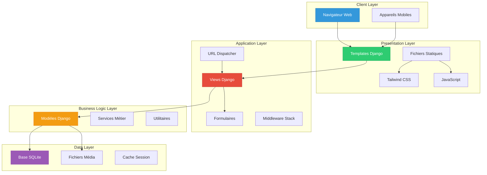
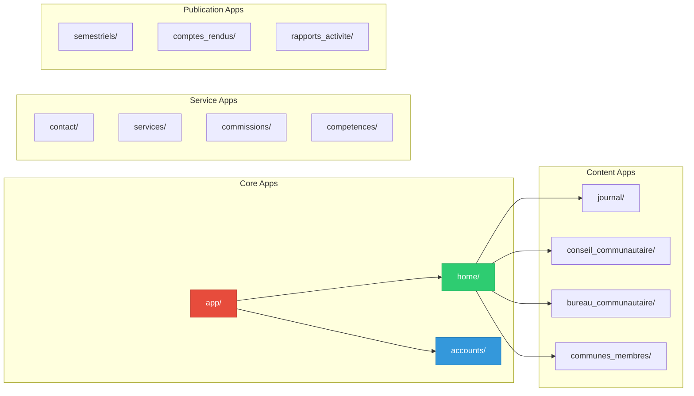
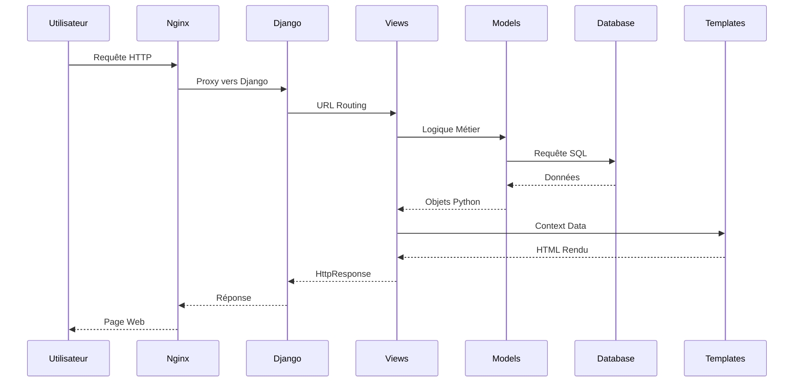
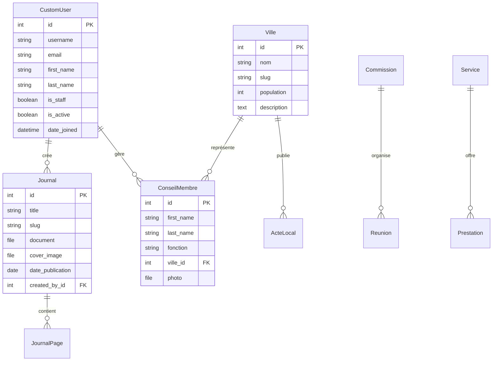
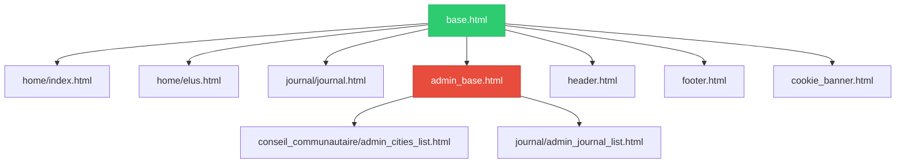
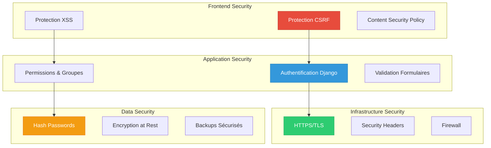

# Architecture du Projet CCSA

## 📋 Vue d'ensemble

Le projet CCSA suit une **architecture Django moderne et modulaire**, structurée en 12 applications métier distinctes. Cette architecture privilégie la séparation des responsabilités, la réutilisabilité et la maintenabilité.

## 🏗️ Architecture Générale



## 🔧 Structure des Applications

### Applications Principales



### Responsabilités par Application

| Application | Responsabilité | Modèles Principaux |
|-------------|----------------|-------------------|
| **app** | Configuration Django, URL routing | Settings, URLConf |
| **home** | Pages principales, navigation | Page statiques |
| **accounts** | Authentification, utilisateurs | CustomUser |
| **conseil_communautaire** | Gestion des élus | Ville, ConseilMembre |
| **journal** | Publications périodiques | Journal, JournalPage |
| **bureau_communautaire** | Bureau et documents | Document, Membre |
| **communes_membres** | 12 communes du territoire | Commune, ActeLocal |
| **contact** | Formulaire de contact | Message, ContactForm |
| **commissions** | Commissions CCSA | Commission, Réunion |
| **competences** | Compétences intercommunales | Domaine, Compétence |
| **semestriels** | Publications semestrielles | SemestrielPage, Event |
| **comptes_rendus** | Comptes-rendus conseils | CompteRendu, Séance |
| **services** | Services aux habitants | Service, Prestation |
| **rapports_activite** | Rapports annuels | RapportActivite |

## 🔀 Flux de Données



## 📁 Structure des Répertoires

### Hiérarchie Complète

```
cc-sudavesnois/
├── app/                          # Configuration Django
│   ├── __init__.py
│   ├── settings.py              # Paramètres globaux
│   ├── urls.py                  # URL racine
│   ├── wsgi.py                  # WSGI application
│   ├── asgi.py                  # ASGI application
│   └── context_processors.py    # Processeurs de contexte
├── home/                         # Application principale
│   ├── views.py                 # Vues principales
│   ├── urls.py                  # Routes
│   ├── models.py                # Modèles (vide)
│   ├── sitemaps.py              # Sitemap XML
│   └── templates/home/          # Templates spécifiques
├── accounts/                     # Authentification
│   ├── models.py                # CustomUser
│   ├── views.py                 # Connexion/Déconnexion
│   ├── forms.py                 # Formulaires auth
│   └── templates/accounts/      # Templates auth
├── [autres_apps]/               # Autres applications Django
├── templates/                    # Templates globaux
│   ├── base.html               # Template de base
│   ├── header.html             # En-tête commun
│   ├── footer.html             # Pied de page
│   └── admin_*.html            # Templates admin
├── static/                       # Fichiers statiques
│   ├── css/                    # Styles CSS
│   ├── js/                     # Scripts JavaScript
│   ├── img/                    # Images
│   └── icones/                 # Icônes
├── media/                        # Fichiers uploadés
├── docs/                         # Documentation
├── requirements.txt              # Dépendances Python
├── package.json                  # Dépendances Node.js
├── tailwind.config.js           # Configuration Tailwind
└── manage.py                     # Script de gestion Django
```

## 🔧 Configuration Système

### Settings Principal

Le fichier `app/settings.py` centralise toute la configuration :

```python
# Configuration des applications
INSTALLED_APPS = [
    "django.contrib.admin",
    "django.contrib.auth",
    "django.contrib.contenttypes",
    "django.contrib.sessions",
    "django.contrib.messages",
    "django.contrib.staticfiles",
    "django.contrib.sitemaps",
    'widget_tweaks',
    # Applications métier
    'home',
    'accounts',
    'conseil_communautaire',
    'journal',
    # ... autres apps
]

# Middleware Stack
MIDDLEWARE = [
    "django.middleware.security.SecurityMiddleware",
    "django.contrib.sessions.middleware.SessionMiddleware",
    "django.middleware.common.CommonMiddleware",
    "django.middleware.csrf.CsrfViewMiddleware",
    "django.contrib.auth.middleware.AuthenticationMiddleware",
    "django.contrib.messages.middleware.MessageMiddleware",
    "django.middleware.clickjacking.XFrameOptionsMiddleware",
]
```

### Routing des URLs

```mermaid
graph TD
    Root[app/urls.py] --> Admin[ccsa-admin/]
    Root --> Home[/ - home.urls]
    Root --> Accounts[/ - accounts.urls]
    Root --> Sitemap[sitemap.xml]
    Root --> Robots[robots.txt]
    Root --> Council[/ - conseil_communautaire.urls]
    Root --> Journal[/ - journal.urls]
    Root --> Bureau[/ - bureau_communautaire.urls]
    Root --> Communes[/ - communes_membres.urls]
    Root --> Services[services/ - services.urls]
    Root --> Contact[/ - contact.urls]
    
    style Root fill:#e74c3c,stroke:#c0392b,color:white
    style Admin fill:#f39c12,stroke:#e67e22,color:white
```

## 🗄️ Architecture de Base de Données

### Modèle Conceptuel



## 🏛️ Architecture des Templates

### Hiérarchie d'Héritage



### Composants Réutilisables

| Template | Utilisation | Inclusions |
|----------|-------------|-----------|
| `base.html` | Template racine | Meta tags, CSS, JS |
| `header.html` | Navigation principale | Menu, logo, recherche |
| `footer.html` | Pied de page | Liens, contact, mentions |
| `cookie_banner.html` | Conformité RGPD | Bannière cookies |
| `admin_base.html` | Interface admin | Sidebar, navigation admin |

## 🔐 Architecture de Sécurité

### Couches de Sécurité



## 🚀 Architecture de Performance

### Optimisations Mises en Place

1. **Static Files Management**
   - Collecte automatique des fichiers statiques
   - Compression CSS/JS en production
   - Versioning des assets

2. **Database Optimization**
   - Index sur les champs fréquemment consultés
   - Requêtes optimisées avec select_related
   - Lazy loading des relations

3. **Caching Strategy** (À implémenter)
   - Cache Redis pour les sessions
   - Cache des vues coûteuses
   - Cache des requêtes fréquentes

4. **Frontend Performance**
   - Tailwind CSS compilé localement
   - Images optimisées
   - JavaScript minifié

## 📊 Métriques d'Architecture

| Métrique | Valeur | Évaluation |
|----------|--------|------------|
| **Couplage** | Faible | ✅ Excellent |
| **Cohésion** | Élevée | ✅ Excellent |
| **Complexité** | Modérée | ✅ Maîtrisée |
| **Réutilisabilité** | Élevée | ✅ Excellent |
| **Maintenabilité** | Élevée | ✅ Excellent |
| **Testabilité** | Élevée | ✅ 54 tests |

---

## 🔧 Points d'Amélioration Identifiés

### Court Terme
- Implémentation du cache Redis
- Optimisation des requêtes N+1
- Ajout de logging structuré

### Moyen Terme  
- Migration vers PostgreSQL
- API REST avec Django REST Framework
- Containerisation Docker

### Long Terme
- Architecture microservices
- Event-driven architecture
- Scalabilité horizontale

---

*Documentation architecture - Dernière mise à jour : 07/01/2025* 