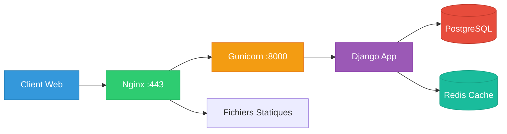

# Guide de Déploiement - Projet CCSA

## 🚀 Vue d'ensemble

Ce guide détaille les procédures complètes de déploiement du projet CCSA (Communauté de Communes Sud-Avesnois) depuis l'environnement de développement jusqu'à la production.

## 📊 Architecture de Déploiement

### Stack Technologique Production

| Composant | Technologie | Version | Rôle |
|-----------|-------------|---------|------|
| **Serveur Web** | Nginx | 1.18+ | Proxy inverse, SSL, fichiers statiques |
| **Serveur WSGI** | Gunicorn | 20.1+ | Interface Python/Django |
| **Framework** | Django | 5.1.7 | Application web |
| **Base de données** | PostgreSQL | 13+ | Stockage données |
| **Cache** | Redis | 6.0+ | Cache et sessions |
| **SSL** | Let's Encrypt | - | Certificats HTTPS |
| **Monitoring** | Systemd | - | Gestion services |

### Diagramme d'Architecture



## 🛠️ Préparation du Serveur

### Configuration Système

```bash
# Mise à jour du système
sudo apt update && sudo apt upgrade -y

# Installation des dépendances système
sudo apt install -y \
    python3 \
    python3-pip \
    python3-venv \
    postgresql \
    postgresql-contrib \
    redis-server \
    nginx \
    git \
    curl \
    certbot \
    python3-certbot-nginx

# Installation Node.js pour Tailwind CSS
curl -fsSL https://deb.nodesource.com/setup_18.x | sudo -E bash -
sudo apt install -y nodejs
```

### Création Utilisateur Système

```bash
# Création utilisateur dédié
sudo adduser --system --group --home /opt/ccsa ccsa

# Ajout aux groupes nécessaires
sudo usermod -aG www-data ccsa
```

## 🗄️ Configuration Base de Données

### Installation PostgreSQL

```bash
# Installation PostgreSQL
sudo apt install postgresql postgresql-contrib

# Création base de données et utilisateur
sudo -u postgres psql << EOF
CREATE DATABASE ccsa_db;
CREATE USER ccsa_user WITH PASSWORD 'your_secure_password_here';
ALTER ROLE ccsa_user SET client_encoding TO 'utf8';
ALTER ROLE ccsa_user SET default_transaction_isolation TO 'read committed';
ALTER ROLE ccsa_user SET timezone TO 'UTC';
GRANT ALL PRIVILEGES ON DATABASE ccsa_db TO ccsa_user;
\q
EOF
```

### Configuration PostgreSQL

```bash
# Édition de la configuration PostgreSQL
sudo nano /etc/postgresql/13/main/postgresql.conf

# Optimisations recommandées
shared_buffers = 256MB
effective_cache_size = 1GB
maintenance_work_mem = 64MB
checkpoint_completion_target = 0.9
wal_buffers = 16MB
default_statistics_target = 100
random_page_cost = 1.1
effective_io_concurrency = 200
```

## 📦 Déploiement de l'Application

### Clonage et Configuration

```bash
# Basculer vers l'utilisateur ccsa
sudo su - ccsa

# Clonage du repository
cd /opt/ccsa
git clone https://github.com/NumeriqueMediapass/CCSA.git app
cd app

# Création environnement virtuel
python3 -m venv venv
source venv/bin/activate

# Installation des dépendances
pip install -r requirements.txt
pip install gunicorn psycopg2-binary
```

### Configuration Environnement Production

```bash
# Création du fichier .env de production
cat > .env << EOF
# Configuration Django Production
SECRET_KEY=your-super-secure-secret-key-50-characters-minimum
DEBUG=False
ALLOWED_HOSTS=cc-sudavesnois.fr,www.cc-sudavesnois.fr

# Base de données PostgreSQL
POSTGRES_DB=ccsa_db
POSTGRES_USER=ccsa_user
POSTGRES_PASSWORD=your_secure_password_here
POSTGRES_HOST=localhost
POSTGRES_PORT=5432

# Sécurité HTTPS
SECURE_SSL_REDIRECT=True
SECURE_HSTS_SECONDS=31536000
SECURE_HSTS_INCLUDE_SUBDOMAINS=True
SECURE_HSTS_PRELOAD=True
SESSION_COOKIE_SECURE=True
CSRF_COOKIE_SECURE=True

# Email SMTP
EMAIL_HOST=smtp.gmail.com
EMAIL_PORT=587
EMAIL_USE_TLS=True
EMAIL_HOST_USER=your-email@gmail.com
EMAIL_HOST_PASSWORD=your-app-password

# Cache Redis
REDIS_URL=redis://localhost:6379/1
EOF

# Sécurisation du fichier .env
chmod 600 .env
```

### Configuration Django Production

```python
# app/settings/production.py
from .base import *
import os

# Configuration production
DEBUG = False
ALLOWED_HOSTS = env('ALLOWED_HOSTS').split(',')

# Base de données PostgreSQL
DATABASES = {
    'default': {
        'ENGINE': 'django.db.backends.postgresql',
        'NAME': env('POSTGRES_DB'),
        'USER': env('POSTGRES_USER'),
        'PASSWORD': env('POSTGRES_PASSWORD'),
        'HOST': env('POSTGRES_HOST', default='localhost'),
        'PORT': env('POSTGRES_PORT', default='5432'),
        'OPTIONS': {
            'charset': 'utf8',
        },
        'CONN_MAX_AGE': 600,  # Connexions persistantes
    }
}

# Cache Redis
CACHES = {
    'default': {
        'BACKEND': 'django_redis.cache.RedisCache',
        'LOCATION': env('REDIS_URL', default='redis://localhost:6379/1'),
        'OPTIONS': {
            'CLIENT_CLASS': 'django_redis.client.DefaultClient',
        }
    }
}

# Sessions dans Redis
SESSION_ENGINE = 'django.contrib.sessions.backends.cache'
SESSION_CACHE_ALIAS = 'default'

# Configuration email SMTP
EMAIL_BACKEND = 'django.core.mail.backends.smtp.EmailBackend'
EMAIL_HOST = env('EMAIL_HOST')
EMAIL_PORT = env.int('EMAIL_PORT', default=587)
EMAIL_USE_TLS = env.bool('EMAIL_USE_TLS', default=True)
EMAIL_HOST_USER = env('EMAIL_HOST_USER')
EMAIL_HOST_PASSWORD = env('EMAIL_HOST_PASSWORD')

# Logging production
LOGGING = {
    'version': 1,
    'disable_existing_loggers': False,
    'formatters': {
        'verbose': {
            'format': '{levelname} {asctime} {module} {process:d} {thread:d} {message}',
            'style': '{',
        },
    },
    'handlers': {
        'file': {
            'level': 'INFO',
            'class': 'logging.FileHandler',
            'filename': '/opt/ccsa/logs/django.log',
            'formatter': 'verbose',
        },
        'error_file': {
            'level': 'ERROR',
            'class': 'logging.FileHandler',
            'filename': '/opt/ccsa/logs/django_errors.log',
            'formatter': 'verbose',
        },
    },
    'root': {
        'handlers': ['file'],
        'level': 'INFO',
    },
    'loggers': {
        'django': {
            'handlers': ['file', 'error_file'],
            'level': 'INFO',
            'propagate': False,
        },
    },
}
```

### Migrations et Collecte des Fichiers

```bash
# Application des migrations
python manage.py migrate --settings=app.settings.production

# Création du superutilisateur
python manage.py createsuperuser --settings=app.settings.production

# Compilation Tailwind CSS
npm install
npm run build

# Collecte des fichiers statiques
python manage.py collectstatic --noinput --settings=app.settings.production

# Création des dossiers de logs
sudo mkdir -p /opt/ccsa/logs
sudo chown ccsa:ccsa /opt/ccsa/logs
```

## 🔧 Configuration Gunicorn

### Fichier de Configuration Gunicorn

```python
# /opt/ccsa/app/gunicorn.conf.py
import multiprocessing

# Configuration serveur
bind = "127.0.0.1:8000"
workers = multiprocessing.cpu_count() * 2 + 1
worker_class = "sync"
worker_connections = 1000
max_requests = 1000
max_requests_jitter = 100
timeout = 30
keepalive = 2

# Utilisateur et groupe
user = "ccsa"
group = "ccsa"

# Logging
accesslog = "/opt/ccsa/logs/gunicorn_access.log"
errorlog = "/opt/ccsa/logs/gunicorn_error.log"
loglevel = "info"
access_log_format = '%(h)s %(l)s %(u)s %(t)s "%(r)s" %(s)s %(b)s "%(f)s" "%(a)s" %(D)s'

# Process
pidfile = "/opt/ccsa/gunicorn.pid"
daemon = False
tmp_upload_dir = None

# Sécurité
limit_request_line = 4094
limit_request_fields = 100
limit_request_field_size = 8190

# Performance
preload_app = True
worker_tmp_dir = "/dev/shm"
```

### Service Systemd pour Gunicorn

```ini
# /etc/systemd/system/ccsa-gunicorn.service
[Unit]
Description=CCSA Gunicorn daemon
Requires=ccsa-gunicorn.socket
After=network.target

[Service]
Type=notify
User=ccsa
Group=ccsa
RuntimeDirectory=gunicorn
WorkingDirectory=/opt/ccsa/app
ExecStart=/opt/ccsa/app/venv/bin/gunicorn \
    --config /opt/ccsa/app/gunicorn.conf.py \
    --env DJANGO_SETTINGS_MODULE=app.settings.production \
    app.wsgi:application
ExecReload=/bin/kill -s HUP $MAINPID
KillMode=mixed
TimeoutStopSec=5
PrivateTmp=true

[Install]
WantedBy=multi-user.target
```

### Socket Systemd pour Gunicorn

```ini
# /etc/systemd/system/ccsa-gunicorn.socket
[Unit]
Description=CCSA Gunicorn socket

[Socket]
ListenStream=/run/gunicorn.sock
SocketUser=www-data
SocketMode=0660

[Install]
WantedBy=sockets.target
```

## 🌐 Configuration Nginx

### Configuration Principale Nginx

```nginx
# /etc/nginx/sites-available/ccsa
server {
    listen 80;
    server_name cc-sudavesnois.fr www.cc-sudavesnois.fr;
    
    # Redirection HTTPS
    return 301 https://$server_name$request_uri;
}

server {
    listen 443 ssl http2;
    server_name cc-sudavesnois.fr www.cc-sudavesnois.fr;
    
    # Configuration SSL
    ssl_certificate /etc/letsencrypt/live/cc-sudavesnois.fr/fullchain.pem;
    ssl_certificate_key /etc/letsencrypt/live/cc-sudavesnois.fr/privkey.pem;
    
    # Configuration SSL sécurisée
    ssl_protocols TLSv1.2 TLSv1.3;
    ssl_ciphers ECDHE-RSA-AES256-GCM-SHA512:DHE-RSA-AES256-GCM-SHA512:ECDHE-RSA-AES256-GCM-SHA384:DHE-RSA-AES256-GCM-SHA384;
    ssl_prefer_server_ciphers off;
    ssl_session_cache shared:SSL:10m;
    ssl_session_timeout 10m;
    
    # Headers de sécurité
    add_header Strict-Transport-Security "max-age=31536000; includeSubDomains; preload" always;
    add_header X-Content-Type-Options "nosniff" always;
    add_header X-Frame-Options "DENY" always;
    add_header X-XSS-Protection "1; mode=block" always;
    add_header Referrer-Policy "strict-origin-when-cross-origin" always;
    
    # Content Security Policy
    add_header Content-Security-Policy "default-src 'self'; script-src 'self' 'unsafe-inline'; style-src 'self' 'unsafe-inline'; img-src 'self' data:; font-src 'self';" always;
    
    # Configuration générale
    client_max_body_size 35M;
    keepalive_timeout 65;
    
    # Logs
    access_log /var/log/nginx/ccsa_access.log;
    error_log /var/log/nginx/ccsa_error.log;
    
    # Fichiers statiques
    location /static/ {
        alias /opt/ccsa/app/staticfiles/;
        expires 1M;
        add_header Cache-Control "public, immutable";
        
        # Compression
        gzip on;
        gzip_vary on;
        gzip_types
            text/css
            text/javascript
            text/xml
            text/plain
            application/javascript
            application/xml+rss
            application/json;
    }
    
    # Fichiers médias
    location /media/ {
        alias /opt/ccsa/app/media/;
        expires 1M;
        add_header Cache-Control "public";
    }
    
    # Robots.txt et sitemap.xml
    location = /robots.txt {
        alias /opt/ccsa/app/staticfiles/robots.txt;
        expires 1d;
    }
    
    location = /sitemap.xml {
        proxy_pass http://127.0.0.1:8000;
        proxy_set_header Host $host;
        proxy_set_header X-Real-IP $remote_addr;
        proxy_set_header X-Forwarded-For $proxy_add_x_forwarded_for;
        proxy_set_header X-Forwarded-Proto $scheme;
    }
    
    # Favicon
    location = /favicon.ico {
        alias /opt/ccsa/app/staticfiles/img/favicon.ico;
        expires 1M;
    }
    
    # Application Django
    location / {
        proxy_pass http://127.0.0.1:8000;
        proxy_set_header Host $host;
        proxy_set_header X-Real-IP $remote_addr;
        proxy_set_header X-Forwarded-For $proxy_add_x_forwarded_for;
        proxy_set_header X-Forwarded-Proto $scheme;
        
        # Timeouts
        proxy_connect_timeout 60s;
        proxy_send_timeout 60s;
        proxy_read_timeout 60s;
        
        # Buffers
        proxy_buffering on;
        proxy_buffer_size 128k;
        proxy_buffers 4 256k;
        proxy_busy_buffers_size 256k;
    }
    
    # Pages d'erreur personnalisées
    error_page 404 /404.html;
    error_page 500 502 503 504 /50x.html;
    
    location = /404.html {
        internal;
        proxy_pass http://127.0.0.1:8000;
    }
    
    location = /50x.html {
        internal;
        proxy_pass http://127.0.0.1:8000;
    }
}
```

### Activation de la Configuration

```bash
# Activation du site
sudo ln -s /etc/nginx/sites-available/ccsa /etc/nginx/sites-enabled/

# Suppression du site par défaut
sudo rm /etc/nginx/sites-enabled/default

# Test de la configuration
sudo nginx -t

# Redémarrage Nginx
sudo systemctl restart nginx
```

## 🔒 Configuration SSL avec Let's Encrypt

### Installation du Certificat SSL

```bash
# Installation du certificat
sudo certbot --nginx -d cc-sudavesnois.fr -d www.cc-sudavesnois.fr

# Vérification du renouvellement automatique
sudo certbot renew --dry-run

# Configuration du renouvellement automatique
sudo crontab -e
# Ajouter la ligne suivante :
0 12 * * * /usr/bin/certbot renew --quiet
```

### Test SSL

```bash
# Test de la configuration SSL
curl -I https://cc-sudavesnois.fr

# Vérification avec SSL Labs
# https://www.ssllabs.com/ssltest/analyze.html?d=cc-sudavesnois.fr
```

## 🚀 Démarrage des Services

### Activation des Services

```bash
# Rechargement systemd
sudo systemctl daemon-reload

# Activation et démarrage des services
sudo systemctl enable ccsa-gunicorn.socket
sudo systemctl enable ccsa-gunicorn.service
sudo systemctl enable nginx
sudo systemctl enable postgresql
sudo systemctl enable redis-server

# Démarrage des services
sudo systemctl start ccsa-gunicorn.socket
sudo systemctl start ccsa-gunicorn.service
sudo systemctl start nginx
sudo systemctl start postgresql
sudo systemctl start redis-server
```

### Vérification des Services

```bash
# Statut des services
sudo systemctl status ccsa-gunicorn
sudo systemctl status nginx
sudo systemctl status postgresql
sudo systemctl status redis-server

# Test de l'application
curl -I https://cc-sudavesnois.fr

# Vérification des logs
sudo journalctl -u ccsa-gunicorn -f
tail -f /opt/ccsa/logs/gunicorn_error.log
tail -f /var/log/nginx/ccsa_error.log
```

## 🔄 Procédures de Mise à Jour

### Script de Déploiement Automatisé

```bash
#!/bin/bash
# /opt/ccsa/deploy.sh

set -e

echo "🚀 Début du déploiement CCSA..."

# Variables
APP_DIR="/opt/ccsa/app"
BACKUP_DIR="/opt/ccsa/backups"
DATE=$(date +%Y%m%d_%H%M%S)

# Fonction de rollback
rollback() {
    echo "❌ Erreur détectée, rollback en cours..."
    cd $APP_DIR
    git checkout HEAD~1
    sudo systemctl restart ccsa-gunicorn
    echo "🔄 Rollback terminé"
    exit 1
}

# Trap pour rollback automatique
trap rollback ERR

# Sauvegarde de la base de données
echo "💾 Sauvegarde de la base de données..."
sudo -u postgres pg_dump ccsa_db > $BACKUP_DIR/db_backup_$DATE.sql

# Mise à jour du code
echo "📥 Mise à jour du code..."
cd $APP_DIR
git fetch origin
git checkout main
git pull origin main

# Activation de l'environnement virtuel
source venv/bin/activate

# Mise à jour des dépendances
echo "📦 Mise à jour des dépendances..."
pip install -r requirements.txt

# Compilation Tailwind CSS
echo "🎨 Compilation Tailwind CSS..."
npm install
npm run build

# Migrations de base de données
echo "🗄️ Application des migrations..."
python manage.py migrate --settings=app.settings.production

# Collecte des fichiers statiques
echo "📁 Collecte des fichiers statiques..."
python manage.py collectstatic --noinput --settings=app.settings.production

# Test de l'application
echo "🧪 Test de l'application..."
python manage.py check --settings=app.settings.production

# Redémarrage des services
echo "🔄 Redémarrage des services..."
sudo systemctl restart ccsa-gunicorn
sudo systemctl reload nginx

# Vérification du déploiement
echo "✅ Vérification du déploiement..."
sleep 5
if curl -f -s https://cc-sudavesnois.fr > /dev/null; then
    echo "🎉 Déploiement réussi !"
else
    echo "❌ Échec du déploiement"
    rollback
fi

echo "📊 Nettoyage des anciennes sauvegardes..."
find $BACKUP_DIR -name "db_backup_*.sql" -mtime +7 -delete

echo "✨ Déploiement terminé avec succès !"
```

### Permissions et Exécution

```bash
# Permissions du script
sudo chmod +x /opt/ccsa/deploy.sh
sudo chown ccsa:ccsa /opt/ccsa/deploy.sh

# Création du dossier de sauvegarde
sudo mkdir -p /opt/ccsa/backups
sudo chown ccsa:ccsa /opt/ccsa/backups

# Exécution du déploiement
sudo -u ccsa /opt/ccsa/deploy.sh
```

## 📊 Monitoring et Maintenance

### Configuration du Monitoring

```bash
# Installation des outils de monitoring
sudo apt install -y htop iotop nethogs

# Configuration des alertes par email
sudo apt install -y mailutils

# Script de monitoring système
cat > /opt/ccsa/monitor.sh << 'EOF'
#!/bin/bash

# Vérification de l'espace disque
DISK_USAGE=$(df / | awk 'NR==2 {print $5}' | sed 's/%//')
if [ $DISK_USAGE -gt 80 ]; then
    echo "⚠️ Espace disque critique: ${DISK_USAGE}%" | mail -s "CCSA - Alerte Espace Disque" admin@cc-sudavesnois.fr
fi

# Vérification de la mémoire
MEM_USAGE=$(free | awk 'NR==2{printf "%.0f", $3*100/$2}')
if [ $MEM_USAGE -gt 90 ]; then
    echo "⚠️ Utilisation mémoire critique: ${MEM_USAGE}%" | mail -s "CCSA - Alerte Mémoire" admin@cc-sudavesnois.fr
fi

# Vérification des services
for service in ccsa-gunicorn nginx postgresql redis-server; do
    if ! systemctl is-active --quiet $service; then
        echo "❌ Service $service arrêté" | mail -s "CCSA - Service Arrêté" admin@cc-sudavesnois.fr
    fi
done

# Vérification de l'application
if ! curl -f -s https://cc-sudavesnois.fr > /dev/null; then
    echo "❌ Site web inaccessible" | mail -s "CCSA - Site Inaccessible" admin@cc-sudavesnois.fr
fi
EOF

chmod +x /opt/ccsa/monitor.sh

# Ajout à la crontab
(crontab -l 2>/dev/null; echo "*/5 * * * * /opt/ccsa/monitor.sh") | crontab -
```

### Sauvegarde Automatisée

```bash
# Script de sauvegarde
cat > /opt/ccsa/backup.sh << 'EOF'
#!/bin/bash

BACKUP_DIR="/opt/ccsa/backups"
DATE=$(date +%Y%m%d_%H%M%S)

# Sauvegarde base de données
sudo -u postgres pg_dump ccsa_db | gzip > $BACKUP_DIR/db_backup_$DATE.sql.gz

# Sauvegarde fichiers médias
tar -czf $BACKUP_DIR/media_backup_$DATE.tar.gz -C /opt/ccsa/app media/

# Sauvegarde configuration
tar -czf $BACKUP_DIR/config_backup_$DATE.tar.gz /etc/nginx/sites-available/ccsa /etc/systemd/system/ccsa-*

# Nettoyage des anciennes sauvegardes (garde 30 jours)
find $BACKUP_DIR -name "*backup_*.gz" -mtime +30 -delete

echo "✅ Sauvegarde terminée: $DATE"
EOF

chmod +x /opt/ccsa/backup.sh

# Sauvegarde quotidienne à 2h du matin
(crontab -l 2>/dev/null; echo "0 2 * * * /opt/ccsa/backup.sh") | crontab -
```

## 🔧 Optimisations Performance

### Configuration Cache Redis

```bash
# Configuration Redis
sudo nano /etc/redis/redis.conf

# Optimisations recommandées
maxmemory 256mb
maxmemory-policy allkeys-lru
save 900 1
save 300 10
save 60 10000
```

### Optimisations Nginx

```nginx
# Ajout dans /etc/nginx/nginx.conf
http {
    # Compression
    gzip on;
    gzip_vary on;
    gzip_min_length 1024;
    gzip_types
        text/plain
        text/css
        text/xml
        text/javascript
        application/javascript
        application/xml+rss
        application/json;
    
    # Cache des fichiers ouverts
    open_file_cache max=1000 inactive=20s;
    open_file_cache_valid 30s;
    open_file_cache_min_uses 2;
    open_file_cache_errors on;
    
    # Buffers
    client_body_buffer_size 128k;
    client_header_buffer_size 1k;
    large_client_header_buffers 4 4k;
    output_buffers 1 32k;
    postpone_output 1460;
}
```

## ✅ Checklist de Déploiement

### Pré-déploiement
- [ ] Serveur configuré et sécurisé
- [ ] Base de données PostgreSQL installée
- [ ] Redis installé et configuré
- [ ] Nginx installé
- [ ] Certificat SSL configuré
- [ ] DNS pointant vers le serveur

### Déploiement
- [ ] Code déployé et dépendances installées
- [ ] Variables d'environnement configurées
- [ ] Migrations appliquées
- [ ] Fichiers statiques collectés
- [ ] Services systemd configurés
- [ ] Nginx configuré et testé

### Post-déploiement
- [ ] Application accessible via HTTPS
- [ ] Tests fonctionnels passants
- [ ] Monitoring configuré
- [ ] Sauvegardes automatisées
- [ ] Logs configurés
- [ ] Performance optimisée

### Maintenance
- [ ] Script de déploiement automatisé
- [ ] Procédure de rollback testée
- [ ] Monitoring des services actif
- [ ] Alertes configurées
- [ ] Documentation à jour

## 🚨 Procédures d'Urgence

### Rollback Rapide

```bash
# Rollback automatique
cd /opt/ccsa/app
git checkout HEAD~1
sudo systemctl restart ccsa-gunicorn
sudo systemctl reload nginx
```

### Restauration Base de Données

```bash
# Restauration depuis sauvegarde
sudo -u postgres dropdb ccsa_db
sudo -u postgres createdb ccsa_db
sudo -u postgres psql ccsa_db < /opt/ccsa/backups/db_backup_YYYYMMDD_HHMMSS.sql
```

### Contacts d'Urgence

```yaml
# Équipe technique
technical_team:
  - admin@cc-sudavesnois.fr
  - technique@cc-sudavesnois.fr

# Hébergeur
hosting_provider:
  - support@ovh.com
  - phone: +33 9 72 10 10 07

# Registrar domaine
domain_registrar:
  - support@gandi.net
  - phone: +33 1 70 37 76 61
```

---

## 📈 Métriques de Performance

### Objectifs de Performance

| Métrique | Objectif | Mesure |
|----------|----------|--------|
| **Temps de réponse** | < 500ms | Temps moyen page |
| **Disponibilité** | 99.9% | Uptime mensuel |
| **Temps de chargement** | < 2s | First Contentful Paint |
| **Score Lighthouse** | > 90 | Performance globale |
| **Temps de déploiement** | < 5min | Pipeline CI/CD |

---

*Guide de déploiement - Dernière mise à jour : 07/01/2025*

# 🚀 Déploiement Automatisé avec GitLab CI/CD et o2switch

## Fonctionnement général
Le pipeline GitLab CI/CD permet d'automatiser les étapes suivantes :
- Tests unitaires et de qualité de code (lint)
- Compilation des fichiers statiques (ex : Tailwind CSS)
- Collecte des fichiers statiques Django
- Déploiement automatique sur l'hébergement o2switch via FTP/SFTP

## Installation étape par étape

### 1. Préparer l'hébergement o2switch
- Crée un compte FTP/SFTP depuis le cPanel o2switch (section "Comptes FTP").
- Note l'adresse du serveur FTP (ex : ftp.tondomaine.fr), l'identifiant et le mot de passe.
- Repère le dossier cible (souvent `www/` ou `public_html/`).

### 2. Ajouter le fichier `.gitlab-ci.yml` à la racine du projet
Utilise le modèle suivant (à adapter selon tes besoins) :

```yaml
stages:
  - test
  - lint
  - build
  - deploy

test:
  stage: test
  image: python:3.12
  script:
    - pip install -r requirements.txt
    - python manage.py test

lint:
  stage: lint
  image: python:3.12
  script:
    - pip install -r requirements.txt
    - flake8

build_static:
  stage: build
  image: node:20-alpine
  script:
    - npm install
    - npx tailwindcss -i ./static/css/input.css -o ./static/css/output.css --minify
  artifacts:
    paths:
      - static/css/output.css

collectstatic:
  stage: build
  image: python:3.12
  script:
    - pip install -r requirements.txt
    - python manage.py collectstatic --noinput
  artifacts:
    paths:
      - static/
      - media/
      - templates/

deploy:
  stage: deploy
  image: alpine:latest
  only:
    - main  # ou la branche à déployer
  before_script:
    - apk add --no-cache lftp
  script:
    - lftp -c "set ftp:list-options -a;
        open -u $FTP_USER,$FTP_PASS $FTP_HOST;
        mirror -Rnev ./ $FTP_TARGET_DIR --ignore-time --parallel=10 --exclude-glob .git* --exclude .git/ --exclude env/ --exclude node_modules/"
  environment:
    name: production
```

### 3. Ajouter les variables d'environnement dans GitLab
1. Va dans **Settings > CI/CD > Variables** de ton projet GitLab.
2. Clique sur **"Add variable"** pour chaque variable suivante :
   - `FTP_USER` : identifiant FTP o2switch
   - `FTP_PASS` : mot de passe FTP o2switch
   - `FTP_HOST` : adresse du serveur FTP (ex : ftp.tondomaine.fr)
   - `FTP_TARGET_DIR` : dossier cible (ex : www/ ou public_html/)
3. **Coche la case "Masked"** (masqué) pour chaque variable contenant un mot de passe ou une information sensible (ex : `FTP_PASS`).
4. **Coche la case "Protected"** si tu veux que la variable ne soit utilisée que sur les branches protégées (ex : main).

### 4. Lancer le pipeline
- Pousse ton code sur la branche concernée (ex : `main`).
- Le pipeline va s'exécuter automatiquement : tests, lint, build, puis déploiement sur o2switch.
- Vérifie les logs du pipeline pour t'assurer que tout s'est bien passé.

### 5. Conseils et bonnes pratiques
- **Ne stocke jamais tes identifiants FTP/SFTP en clair dans le dépôt.** Utilise toujours les variables GitLab CI/CD.
- **Adapte les chemins** (`static/`, `media/`, etc.) selon la structure de ton projet.
- Pour un déploiement SFTP, remplace dans le script :
  ```yaml
  open -u $FTP_USER,$FTP_PASS $FTP_HOST;
  ```
  par
  ```yaml
  open -u $FTP_USER,$FTP_PASS sftp://$FTP_HOST;
  ```
- Pour Django, pense à exécuter les migrations manuellement si besoin (`python manage.py migrate`).

---

**Pour toute question ou adaptation spécifique, consulte la documentation officielle de GitLab CI/CD ou contacte l'équipe technique.**

# Déploiement sur un hébergement mutualisé o2switch avec l'assistant Python

## Présentation
L'hébergement mutualisé o2switch propose un assistant Python intégré dans le cPanel, permettant de déployer facilement une application Django. Voici les étapes à suivre pour un déploiement efficace, en complément ou en remplacement d'un pipeline GitLab CI/CD.

---

## 1. Déploiement du code
- Utilise GitLab CI/CD (ou un client FTP/SFTP) pour transférer le code source dans le dossier de ton environnement Python sur o2switch.
- Le pipeline GitLab peut automatiser cette étape (voir section précédente pour le script FTP/SFTP).

## 2. Création et gestion de l'environnement Python
- Connecte-toi au cPanel o2switch.
- Va dans "Setup Python App" (ou "Application Python" selon la langue).
- Crée un nouvel environnement Python (choisis la version recommandée pour Django, ex : 3.10+).
- Note le chemin du dossier d'application (ex : `/home/tonuser/monapp/`).

## 3. Installation des dépendances
- Dans l'assistant Python, utilise le champ "Requirements file" pour pointer vers ton `requirements.txt` (ex : `/home/tonuser/monapp/requirements.txt`).
- Clique sur "Installer les modules" pour lancer l'installation automatique.
- Tu peux aussi installer des paquets manuellement via le champ "Entrer une commande" (ex : `pip install pillow`).

## 4. Configuration du point d'entrée (WSGI)
- Indique le chemin du fichier WSGI (ex : `/home/tonuser/monapp/app/wsgi.py`).
- Vérifie que le module WSGI est bien configuré dans l'assistant Python.

## 5. Variables d'environnement
- Dans l'assistant Python, ajoute toutes les variables nécessaires (ex : `DJANGO_SECRET_KEY`, `DEBUG`, `ALLOWED_HOSTS`, etc.).
- **Ne mets jamais ces variables dans le code source**.
- Utilise l'interface pour ajouter/modifier/supprimer ces variables à tout moment.

## 6. Collecte des fichiers statiques
- Exécute la commande `python manage.py collectstatic` sur le serveur (via SSH si disponible, ou via le champ "Entrer une commande" dans l'assistant Python).
- Sinon, lance la commande en local et transfère le dossier `static/` via FTP/SFTP.

## 7. Test de l'application
- Utilise l'URL fournie par o2switch pour tester ton application (souvent de la forme `https://tondomaine.fr` ou une URL temporaire).
- Vérifie que tout fonctionne (pages, fichiers statiques, base de données, etc.).

---

## Points importants
- **Le pipeline GitLab CI/CD** peut automatiser l'envoi du code, mais l'installation des dépendances et la configuration de l'environnement Python se font via le cPanel o2switch.
- **Les variables d'environnement sensibles** (clé Django, DB, etc.) doivent être saisies dans l'assistant Python, jamais dans le code.
- **Le point d'entrée WSGI** doit être correctement configuré pour que l'application fonctionne.
- **La collecte des fichiers statiques** est indispensable pour servir correctement le CSS/JS/images.

---

## Conseils
- Teste toujours la connexion FTP/SFTP et l'accès à l'assistant Python avant de lancer un déploiement automatisé.
- Pour les mises à jour, pense à relancer l'installation des dépendances si tu modifies le `requirements.txt`.
- Consulte la documentation o2switch pour les limitations spécifiques à l'hébergement mutualisé (temps d'exécution, accès SSH, etc.).

---

**Pour toute question ou problème, contactes le support o2switch ou ton équipe technique.**

# Ajout d'une clé SSH sur o2switch pour git clone

## Pourquoi utiliser une clé SSH ?
- Permet de cloner un dépôt privé (GitLab, GitHub...) directement depuis o2switch sans mot de passe.
- Sécurise l'accès au dépôt (évite de mettre un mot de passe en clair dans un script).

## Étapes détaillées

### 1. Générer une clé SSH (si tu n'en as pas déjà une)
Sur ta machine locale :
```bash
ssh-keygen -t ed25519 -C "o2switch"
```
Appuie sur Entrée pour accepter le chemin par défaut, et choisis une passphrase ou non.

### 2. Ajouter la clé publique sur GitLab (ou GitHub)
- Copie le contenu de `~/.ssh/id_ed25519.pub`
- Va dans **GitLab > Settings > SSH Keys** (ou GitHub > Settings > SSH and GPG keys)
- Colle la clé et valide

### 3. Installer la clé privée sur o2switch
- Connecte-toi à o2switch via FTP/SFTP ou SSH
- Place le fichier `id_ed25519` (clé privée) dans le dossier `~/.ssh/` de ton hébergement
- Assure-toi que les droits sont corrects :
  ```bash
  chmod 700 ~/.ssh
  chmod 600 ~/.ssh/id_ed25519
  ```

### 4. Tester la connexion
Sur o2switch (via SSH ou via le terminal de l'assistant Python) :
```bash
ssh -T git@gitlab.com
```
Tu dois voir un message de bienvenue.

### 5. Cloner le dépôt
Toujours sur o2switch :
```bash
git clone git@gitlab.com:utilisateur/mon-projet.git
```
