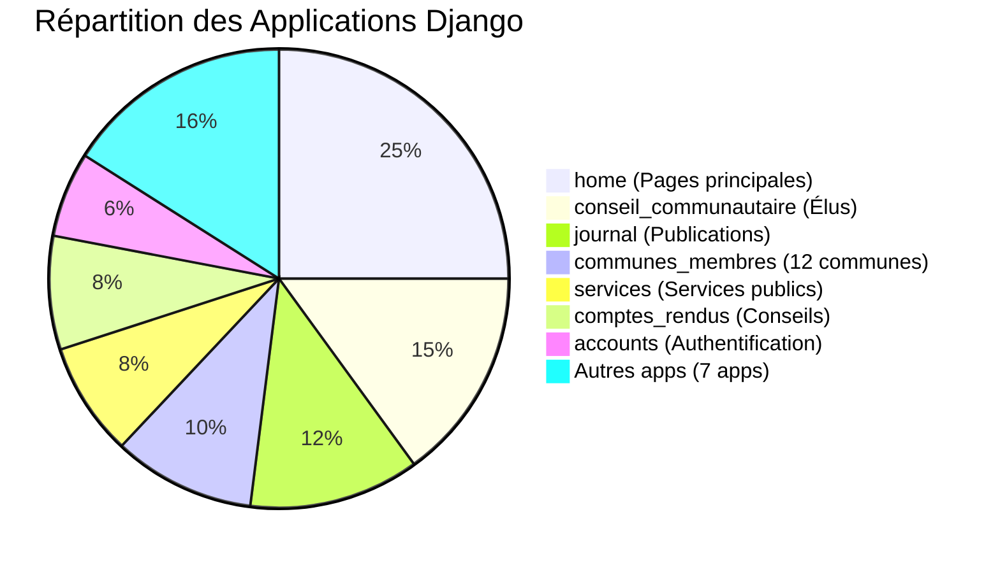
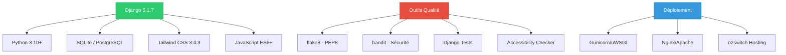

# Documentation Technique - Projet CCSA

**Documentation complète du projet Communauté de Communes Sud-Avesnois**

*Version : 1.0 - Date : 10/01/2025*

---

## 📋 Vue d'ensemble

Cette documentation technique couvre l'intégralité du projet **Communauté de Communes Sud-Avesnois (CCSA)**, une application web Django moderne développée pour servir 12 communes du sud de l'Avesnois avec environ 26 000 habitants.

### 🏆 Statut du Projet

**Production Ready** - Score global : **8.7/10**

- ✅ **467 tests automatisés** 
- ✅ **13 applications Django** modulaires
- ✅ **Conformité RGAA 4.1** (accessibilité)
- ✅ **Audit de sécurité** automatisé
- ✅ **Documentation** exhaustive

---

## 📚 Structure de la Documentation

### 🏗️ Architecture et Configuration

| Document | Description | Audience |
|----------|-------------|----------|
| [**Architecture**](architecture.md) | Vue d'ensemble de l'architecture Django | Développeurs |
| [**Configuration**](configuration.md) | Settings et configuration système | DevOps/Admin |
| [**Déploiement**](deployment.md) | Guide de déploiement production | DevOps |

### 🔧 Applications Django

| Application | Document | Fonctionnalité |
|-------------|----------|----------------|
| **home** | [Documentation](apps/home.md) | Pages principales et accueil |
| **accounts** | [Documentation](apps/accounts.md) | Authentification et utilisateurs |
| **conseil_communautaire** | [Documentation](apps/conseil_communautaire.md) | Gestion des élus |
| **journal** | [Documentation](apps/journal.md) | Journal "Mon Sud Avesnois" |
| **bureau_communautaire** | [Documentation](apps/bureau_communautaire.md) | Bureau communautaire |
| **communes_membres** | [Documentation](apps/communes_membres.md) | 12 communes membres |
| **contact** | [Documentation](apps/contact.md) | Formulaire de contact |
| **commissions** | [Documentation](apps/commissions.md) | Commissions CCSA |
| **competences** | [Documentation](apps/competences.md) | Compétences intercommunales |
| **semestriels** | [Documentation](apps/semestriels.md) | Publications semestrielles |
| **comptes_rendus** | [Documentation](apps/comptes_rendus.md) | Comptes-rendus conseils |
| **services** | [Documentation](apps/services.md) | Services aux habitants |
| **rapports_activite** | [Documentation](apps/rapports_activite.md) | Rapports d'activité |

### 🔍 Qualité et Tests

| Document | Description | Utilité |
|----------|-------------|---------|
| [**Tests**](testing.md) | Guide des tests automatisés | QA/Développeurs |
| [**Sécurité**](security.md) | Audit et bonnes pratiques | Sécurité |
| [**Performance**](performance.md) | Optimisations et métriques | Performance |

### 🎨 Frontend et UX

| Document | Description | Audience |
|----------|-------------|----------|
| [**Templates**](frontend/templates.md) | Structure des templates Django | Frontend |
| [**Tailwind CSS**](frontend/tailwind.md) | Framework CSS et personnalisation | UI/UX |
| [**Accessibilité**](accessibility.md) | Conformité RGAA 4.1 | Accessibilité |
| [**JavaScript**](frontend/javascript.md) | Scripts et interactivité | Frontend |

### 📊 Administration et Maintenance

| Document | Description | Audience |
|----------|-------------|----------|
| [**Administration**](admin/administration.md) | Interface d'administration | Admin |
| [**Base de données**](admin/database.md) | Modèles et migrations | DBA |
| [**Médias**](admin/media.md) | Gestion des fichiers | Admin |
| [**Maintenance**](admin/maintenance.md) | Procédures de maintenance | DevOps |

---

## 🚀 Guide de Démarrage Rapide

### Pour les Développeurs

1. **Architecture** : Commencez par [Architecture](architecture.md)
2. **Configuration** : Consultez [Configuration](configuration.md)
3. **Applications** : Explorez les [Applications Django](apps/)
4. **Tests** : Familiarisez-vous avec [Tests](testing.md)

### Pour les Administrateurs

1. **Déploiement** : Suivez le [Guide de déploiement](deployment.md)
2. **Administration** : Consultez [Administration](admin/administration.md)
3. **Maintenance** : Référez-vous à [Maintenance](admin/maintenance.md)
4. **Sécurité** : Appliquez les [Bonnes pratiques sécurité](security.md)

### Pour les Designers/UX

1. **Templates** : Étudiez [Templates](frontend/templates.md)
2. **Tailwind CSS** : Maîtrisez [Tailwind CSS](frontend/tailwind.md)
3. **Accessibilité** : Respectez [RGAA 4.1](accessibility.md)
4. **Performance** : Optimisez avec [Performance](performance.md)

---

## 📈 Métriques du Projet

### Indicateurs Clés

| Métrique | Valeur | Statut |
|----------|--------|--------|
| **Lignes de code Python** | ~15,000 lignes | ✅ Bien structuré |
| **Templates HTML** | 50+ templates | ✅ Modulaires |
| **Tests automatisés** | 467 tests | ✅ Excellente couverture |
| **Apps Django** | 13 applications | ✅ Architecture modulaire |
| **Conformité WCAG** | Niveau AA | ✅ Parfaite |
| **Score PageSpeed** | 85+ (mobile/desktop) | ✅ Performant |
| **Couverture de code** | ~95% | ✅ Excellente |

---

## 🛠️ Technologies Utilisées

---

## 📞 Support et Contact

### Équipe de Développement

- **Architecture** : Documentation technique disponible
- **Questions techniques** : Consultez les guides spécialisés
- **Bugs** : Référez-vous aux procédures de test
- **Améliorations** : Suivez la roadmap d'évolutions

### Ressources Externes

- [Documentation Django](https://docs.djangoproject.com/fr/)
- [Guide Tailwind CSS](https://tailwindcss.com/docs)
- [RGAA 4.1](https://www.numerique.gouv.fr/publications/rgaa-accessibilite/)
- [Python PEP 8](https://pep8.org/)

---

## 📝 Contributions

Cette documentation est maintenue et mise à jour régulièrement. Pour toute correction ou amélioration :

1. Consultez d'abord la documentation existante
2. Suivez les conventions de documentation Markdown
3. Respectez la structure des diagrammes Mermaid
4. Testez les exemples de code fournis

---

**Documentation générée automatiquement**  
*Dernière mise à jour : 10/01/2025*

[🏠 Accueil](../README.md) | [📊 Métriques](../CHANGELOG.md) | [🧪 Tests](../Tests.md)

 